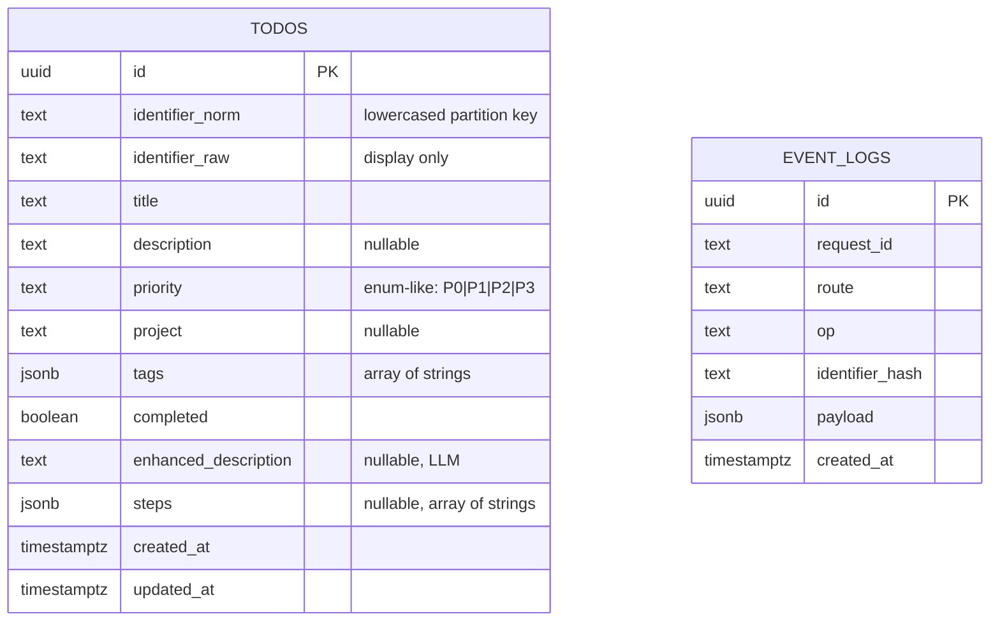

# SLS To-Do — Entity–Relationship Design (ERD)

**Version:** 1.0  
**Status:** Approved for implementation  
**Source of truth:** Mirrors PRD §1.4 and API-SPEC.md §1.1.  
**Scope:** Minimal schema required for v1.0 with forward-compat fields for Chat/LLM enrichment and WhatsApp adapter (no refactors later).

---

## 1) Design Goals

* **Single-table core** for v1.0 (`todos`) with strict partitioning by Identifier (email/name) via `identifier_norm`.
* **Forward-compatibility**: enrichment fields (`enhanced_description`, `steps`) exist from day-1.
* **Operational performance**: indexes for common predicates (`identifier_norm`, `completed`, `created_at`).
* **Safety**: server-only service role; client accesses scoped reads only. (RLS strategy deferred; see notes.)

---

## 2) ER Diagram (Mermaid)



> **Note**: `EVENT_LOGS` is optional (ops/observability). Not required for v1.0 acceptance; keep as future ADR.

---

## 3) Entities & Fields

### 3.1 `todos` (required)

| Column                  | Type         | Nullable | Default                    | Notes                                    |
| ----------------------- | ------------ | -------- | -------------------------- | ---------------------------------------- |
| `id`                    | uuid         | no       | `gen_random_uuid()`        | Primary key                              |
| `identifier_norm`       | text         | no       | —                          | Lowercased, trimmed, single-spaced; query partition |
| `identifier_raw`        | text         | no       | —                          | Original user input (display only)       |
| `title`                 | text         | no       | —                          | 1–200 chars, trimmed                     |
| `description`           | text         | yes      | `null`                     | ≤ 2000 chars                            |
| `priority`              | text         | no       | `'P2'`                     | Allowed: `P0`, `P1`, `P2`, `P3`         |
| `project`               | text         | yes      | `null`                     | ≤ 80 chars                              |
| `tags`                  | jsonb        | yes      | `'[]'::jsonb`              | Array of lowercase strings; deduped client/server |
| `completed`             | boolean      | no       | `false`                    | —                                        |
| `enhanced_description`  | text         | yes      | `null`                     | LLM enrichment                           |
| `steps`                 | jsonb        | yes      | `null`                     | Array of strings from LLM                |
| `created_at`            | timestamptz  | no       | `now()`                    | —                                        |
| `updated_at`            | timestamptz  | no       | `now()` (trigger)          | Auto-updated on change                   |

### Constraints (recommended at DB level)

```sql
CHECK (priority IN ('P0','P1','P2','P3'))
CHECK (jsonb_typeof(tags) = 'array') -- when not null
```

> **Optional**: lightweight length checks via triggers (or enforce lengths in server code; DB check is fine for priority only).

### Indexes

```sql
CREATE INDEX idx_todos_identifier_norm ON todos (identifier_norm);
CREATE INDEX idx_todos_identifier_completed ON todos (identifier_norm, completed);
CREATE INDEX idx_todos_created_at ON todos (created_at DESC);
```

### Updated-at trigger (Postgres)

Function `set_updated_at()` that sets `NEW.updated_at = now()`; trigger `BEFORE UPDATE ON todos`.

---

## 4) Data Semantics & Invariants

* **Identifier partitioning**: All queries MUST include `WHERE identifier_norm = :norm`.
* **Normalization (server layer)**:
  * Trim, collapse internal whitespace to single space, lowercase → `identifier_norm`.
  * Persist original value as `identifier_raw`.
* **Tags**: array of unique, trimmed, lowercase strings; each 1–24 chars; max 20 elements. De-duplication is enforced in server action; DB enforces array type.
* **Sorting**: Active list default `ORDER BY created_at DESC, id DESC`. Completed in its own section with same ordering.

---

## 5) Example DDL (authoritative extract)

> Full file in `docs/DB-SCHEMA.sql`. Shown here for review.

```sql
create extension if not exists pgcrypto;

create table if not exists public.todos (
  id                     uuid primary key default gen_random_uuid(),
  identifier_norm        text not null,
  identifier_raw         text not null,
  title                  text not null,
  description            text,
  priority               text not null default 'P2',
  project                text,
  tags                   jsonb not null default '[]'::jsonb,
  completed              boolean not null default false,
  enhanced_description   text,
  steps                  jsonb,
  created_at             timestamptz not null default now(),
  updated_at             timestamptz not null default now(),
  constraint chk_priority check (priority in ('P0','P1','P2','P3')),
  constraint chk_tags_array check (jsonb_typeof(tags) = 'array')
);

create index if not exists idx_todos_identifier_norm
  on public.todos (identifier_norm);

create index if not exists idx_todos_identifier_completed
  on public.todos (identifier_norm, completed);

create index if not exists idx_todos_created_at
  on public.todos (created_at desc);

create or replace function public.set_updated_at()
returns trigger language plpgsql as $$
begin
  new.updated_at = now();
  return new;
end; $$;

drop trigger if exists trg_set_updated_at on public.todos;
create trigger trg_set_updated_at
before update on public.todos
for each row execute function public.set_updated_at();
```

---

## 6) Query Patterns (reference)

### List active (paged):

```sql
select *
from public.todos
where identifier_norm = $1
  and completed = false
order by created_at desc, id desc
limit $2 offset $3;
```

### List completed (paged, on expand):

```sql
select *
from public.todos
where identifier_norm = $1
  and completed = true
order by created_at desc, id desc
limit $2 offset $3;
```

### Toggle complete:

```sql
update public.todos
set completed = not completed
where id = $1 and identifier_norm = $2
returning *;
```

### Patch subset (server builds dynamic update):

```sql
update public.todos
set
  title        = coalesce($3, title),
  description  = coalesce($4, description),
  priority     = coalesce($5, priority),
  project      = coalesce($6, project),
  tags         = coalesce($7, tags),
  completed    = coalesce($8, completed)
where id = $1 and identifier_norm = $2
returning *;
```

---

## 7) RLS Posture (future, not required v1.0)

For production-grade isolation without changing UI/schema:

* Enable RLS on `public.todos`.
* Create a Supabase Edge Function that validates a lightweight bearer (or real auth) and adds a session variable (e.g., `request.header('x-identifier-norm')`).
* **Policies**:
  ```sql
  USING (identifier_norm = current_setting('request.jwt.claims.identifier_norm', true))
  ```
  Mutations restricted similarly.
* Client continues to call server endpoints; server calls Edge Function/service role. No UI changes.

---

## 8) Migration Strategy

* **V1**: create `todos`, indexes, trigger.
* **Forward**: adding columns should be nullable first; backfill in background; then tighten if needed.
* No destructive migrations in v1.0 (assessment). For column renames, add new + backfill + deprecate old.

---

## 9) Data Retention & Privacy

* **Retention**: no automatic purges in v1.0.
* **Deletion**: hard delete on user action (Undo handled client-side within 5s).
* **Privacy**: `identifier_raw` may look like an email; used only as a label; not verified or used to contact. Avoid logging `identifier_raw`; prefer hashed/truncated in logs.

---

## 10) Known Trade-offs

* **Single table** keeps the demo lean; at scale, consider splitting enrichment (`todo_enrichments`) and adding composite indexes for reporting.
* **No RLS (demo)** relies on app scoping; documented in `SECURITY.md`.
* **Tags semantics** validated mainly in server; DB only checks array type for simplicity.

---

## File Map

```
/docs
  ERD.md            <-- (this file)
  DB-SCHEMA.sql     <-- executable DDL
  API-SPEC.md
  ARCHITECTURE.md
```

> **Any change to fields/indexes MUST update `ERD.md`, `DB-SCHEMA.sql`, and `API-SPEC.md` in the same PR.**
