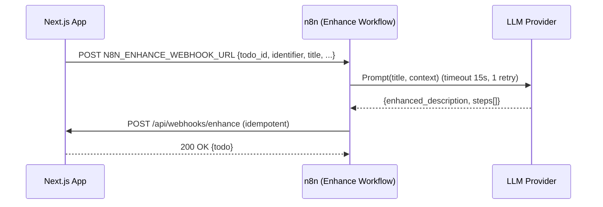

# SLS To-Do — n8n Workflow (Title Enrichment)

**Version:** 1.1 (Normalized)  
**Status:** Approved for implementation  
**Owners:** Integrations (n8n), Backend

**Purpose:** Define the exact contract and steps for the Title → Enriched Description & Steps workflow using n8n. This document is the single source of truth for payloads, timeouts, retries, idempotency, and the preferred callback into our app.

---

## 0) Scope & Non-Goals

**In scope**
* Trigger on task creation and on title update.
* Asynchronously call an LLM to produce:
  * `enhanced_description` (concise, useful, plain text)
  * `steps` (0–8 simple step strings)
* Callback into the app via `/api/webhooks/enhance` (idempotent upsert).

**Out of scope (v1.0)**
* Direct DB mutations from n8n (we keep the app boundary).
* Real-time streaming updates, parallel enrichments.
* Multi-language or domain-specific plugins (can be added later).

---

## 1) End-to-End Flow (overview)



> **Design choice:** n8n does not write to Supabase directly. It always calls the app's `/api/webhooks/enhance` (see API-SPEC.md) to keep validation, auditing, and security in one place.

---

## 2) Contracts (payloads & headers)

### 2.1 App → n8n (Trigger Webhook)

**URL:** `N8N_ENHANCE_WEBHOOK_URL` (from `.env`)  
**Example (local):** `http://localhost:5678/webhook/enhance`

**Method:** POST

**Headers:**
* `Content-Type: application/json`
* Optional: `X-App-Signature: <HMAC-SHA256(hex)>` (see §6 for signing)

**Body:**
```json
{
  "todo_id": "b3d1bb6a-1c59-4c02-8c6f-8c7a1e0f0fd0",
  "identifier": "john@example.com",
  "title": "Schedule dentist in Chicago",
  "meta": {
    "source": "create|edit_title",
    "app_version": "1.0.0",
    "locale": "en-US",
    "tz": "America/Monterrey"
  }
}
```

**Notes**
* `meta` is optional. `identifier` is only for scoping; n8n must not echo it to any 3rd party logs.

**Response (from n8n to the App trigger)**
* `200 OK` quickly (≤ 100ms). n8n should ack immediately and run async.

### 2.2 n8n → App (Callback)

**URL:** `POST https://<app>/api/webhooks/enhance`

**Headers:**
* `Content-Type: application/json`
* Optional: `X-Workflow-Signature: <HMAC-SHA256(hex)>` (see §6)

**Body (contract from API-SPEC.md):**
```json
{
  "todo_id": "b3d1bb6a-1c59-4c02-8c6f-8c7a1e0f0fd0",
  "identifier": "john@example.com",
  "title": "Schedule dentist in Chicago",
  "enhanced_description": "Book an appointment with a local dentist in Chicago. Compare availability, insurance coverage, and travel time. Keep contact details handy.",
  "steps": [
    "List 3 nearby clinics that take your insurance",
    "Call or check online availability",
    "Book appointment; add to calendar",
    "Save clinic address and phone number",
    "Set a reminder the day before"
  ]
}
```

**Response:** `200 OK { todo: {...} }` or `404/400` error envelope.

**Idempotency:** The endpoint is idempotent. Replays simply overwrite `enhanced_description`/`steps`.

---

## 3) n8n Workflow (node-by-node)

A minimal importable JSON example is provided in §9.

### Node 1 — Webhook (Trigger)

**Type:** Webhook  
**Path:** `/webhook/enhance` (or any path you set in n8n)  
**HTTP Method:** POST  
**Respond:** Immediately with `200 OK` and body:
```json
{"ok":true,"received":true}
```

**Security:** If using Basic Auth on the webhook, configure credentials and ensure the App includes them; otherwise rely on secret URL + optional HMAC (see §6).

### Node 2 — Validate Input (Function)

**Goal:** Validate schema; coerce types; defensive defaults.

**Pseudocode:**
```javascript
const b = items[0].json;
function isUUID(v){ return /^[0-9a-fA-F-]{36}$/.test(v||''); }
if (!b || !isUUID(b.todo_id) || !b.title) {
  throw new Error('BAD_REQUEST: todo_id (uuid) and title are required');
}
return items;
```

### Node 3 — (Optional) De-dupe Guard (Function)

**Strategy:** Compute hash `dedupeKey = sha256(todo_id + '|' + (b.meta?.source||''))`.

Use n8n static data (`this.getWorkflowStaticData('global')`) to store last 100 keys for 15 minutes to avoid rapid re-enrich.

Even without this, the callback is idempotent. This is a soft throttle.

### Node 4 — Prepare Prompt (Function)

Read title, locale, tz. Build prompt (the canonical text is in `docs/LLM-PROMPTS.md`).

**Minimal prompt:**
```javascript
const { title, meta } = items[0].json;
const prompt = `
You are a concise task assistant. Given a user task title, produce:
1) A one-paragraph helpful plain-text description (<= 400 chars).
2) 0-8 short steps, each <= 90 chars, plain text, no numbering.
Input title: "${title}"
Output as JSON with fields: enhanced_description, steps (array of strings).
`;
return [{ json: { prompt } }];
```

### Node 5 — LLM Call (HTTP Request)

(Use OpenAI or your preferred provider; or call your internal LLM gateway.)

**Method:** POST  
**URL:** provider endpoint (e.g., `https://api.openai.com/v1/chat/completions`)  
**Headers:** `Authorization: Bearer {{ $json.OPENAI_API_KEY }}` or use n8n credentials  
**Timeout:** 15 seconds  
**Retries:** 1 (n8n Continue On Fail=false, but wrap in Try/Catch branch or use an IF + Wait + retry 1x)

**Response mapping:** extract JSON from the model output; must parse safely:

```javascript
// Function node after HTTP to parse/guard
const raw = items[0].json; // model response
// ...locate text (e.g., choices[0].message.content)...
let obj = {};
try { obj = JSON.parse(extractedText); } catch (e) {
  // Fallback: attempt to regex pull fields or mark as empty
  obj = { enhanced_description: null, steps: null };
}
function clampText(s, max){ return (s||'').slice(0, max); }
const desc = clampText(obj.enhanced_description, 400) || null;
let steps = Array.isArray(obj.steps) ? obj.steps.slice(0,8) : null;
if (steps) steps = steps.map(s => clampText(String(s), 90)).filter(Boolean);
return [{ json: { enhanced_description: desc, steps } }];
```

### Node 6 — Build Callback Payload (Function)

Merge original trigger with LLM output:

```javascript
const trigger = $item(0, 0).json;      // from Webhook
const enrich  = items[0].json;          // from LLM Parse
return [{
  json: {
    todo_id: trigger.todo_id,
    identifier: trigger.identifier,
    title: trigger.title,
    enhanced_description: enrich.enhanced_description || null,
    steps: enrich.steps || null
  }
}];
```

### Node 7 — POST to App `/api/webhooks/enhance` (HTTP Request)

**Method:** POST  
**URL:** `https://<app>/api/webhooks/enhance`  
**Headers:**
* `Content-Type: application/json`
* Optional: `X-Workflow-Signature: {{$json.signature}}` (see §6)

**Body:** raw JSON (from Node 6)  
**Timeout:** 10 seconds  
**Retries:** 2 with exponential backoff (1s, 3s)

**On 404 NOT_FOUND:** Stop (task was deleted), but log.  
**On 400 BAD_REQUEST or 500:** retry according to policy; then fail and log.

### Node 8 — Success Log (Function)

Emit structured log (no PII):

```javascript
const id = $json.todo_id;
return [{ json: { ok: true, op: 'enhance', todo_id: id } }];
```

### Node 9 — Failure Path (Catch)

Use n8n's Error Trigger or connected IF nodes to route failures to:

* Log error with context (no raw prompt or identifier).
* Do not retry indefinitely; cap attempts.

---

## 4) Timeouts, Retries, Idempotency

* **LLM:** 15s timeout, 1 retry (hard cap to avoid pile-ups).
* **Callback:** 10s timeout, 2 retries (1s, then 3s).
* **Idempotency:** `/api/webhooks/enhance` overwrites enrichment fields safely.
* At-least-once delivery is acceptable; client UI tolerates late/missing enrichment.

---

## 5) Data Rules (output constraints)

* **enhanced_description:**
  * Plain text; no HTML/Markdown; ≤ 400 chars; may be null if the LLM fails.
* **steps:** array of 0–8 strings; each ≤ 90 chars; plain text; may be null.
* Never include PII, URLs, or phone numbers in outputs.
* Outputs are advisory; the app renders them as plain text.

---

## 6) Security (signing & redaction)

**Recommended signing (HMAC-SHA256)**
* **App → n8n:** Add header `X-App-Signature: HMAC_SHA256( APP_SIGNING_SECRET, rawBody )`.
* **n8n → App:** Add header `X-Workflow-Signature: HMAC_SHA256( WORKFLOW_SIGNING_SECRET, rawBody )`.
* Validate on each side (reject on mismatch). Keep secrets in env on both ends.

**n8n data handling**
* Do not store raw identifiers or prompts in persistent logs.
* Mask provider API keys; restrict n8n credentials to the workflow.

---

## 7) Local Dev & Testing

### 7.1 Run n8n locally

Docker or binary. Common webhook URL: `http://localhost:5678/webhook/enhance`.

Set `N8N_ENHANCE_WEBHOOK_URL` in `.env.local`.

### 7.2 Manual trigger (cURL)

```bash
curl -X POST http://localhost:5678/webhook/enhance \
  -H "Content-Type: application/json" \
  -d '{
    "todo_id":"b3d1bb6a-1c59-4c02-8c6f-8c7a1e0f0fd0",
    "identifier":"john@example.com",
    "title":"Schedule dentist in Chicago",
    "meta":{"source":"create","locale":"en-US","tz":"America/Monterrey"}
  }'
```

### 7.3 Callback to app (simulate from terminal)

```bash
curl -X POST https://<app>/api/webhooks/enhance \
  -H "Content-Type: application/json" \
  -d '{
    "todo_id":"b3d1bb6a-1c59-4c02-8c6f-8c7a1e0f0fd0",
    "identifier":"john@example.com",
    "title":"Schedule dentist in Chicago",
    "enhanced_description":"Book an appointment...",
    "steps":["Find clinics","Check availability","Book"]
  }'
```

### 7.4 Test cases coverage

See `TEST-PLAN.md` §10 (TC-120..124). Ensure 404 behavior and idempotency.

---

## 8) Observability

* **n8n logs:** success/fail per run; include `todo_id`, `op: "enhance"`, `duration_ms`.
* **App logs:** include `request_id` on `/api/webhooks/enhance`; correlate with n8n run id if passed in headers.
* **Redaction:** Do not log `identifier_raw` or full LLM prompts/outputs in prod.

---

## 9) Minimal Importable Workflow (example JSON)

This is a compact example (HTTP-only; you'll need to add your provider credentials and adjust node IDs). Import into n8n, then edit the HTTP Request nodes.

```json
{
  "name": "SLS To-Do - Title Enrichment",
  "nodes": [
    {
      "parameters": {
        "path": "enhance",
        "options": {
          "responseCode": 200,
          "responseMode": "onReceived",
          "responseData": "{\"ok\":true,\"received\":true}"
        }
      },
      "id": "WebhookEnhance",
      "name": "Webhook - Enhance",
      "type": "n8n-nodes-base.webhook",
      "typeVersion": 1,
      "position": [240, 300]
    },
    {
      "parameters": {
        "functionCode": "const b = items[0].json;\nfunction isUUID(v){ return /^[0-9a-fA-F-]{36}$/.test(v||''); }\nif (!b || !isUUID(b.todo_id) || !b.title) { throw new Error('BAD_REQUEST: todo_id (uuid) and title required'); }\nreturn items;"
      },
      "id": "ValidateInput",
      "name": "Validate Input",
      "type": "n8n-nodes-base.function",
      "typeVersion": 1,
      "position": [520, 300]
    },
    {
      "parameters": {
        "functionCode": "const { title } = items[0].json;\nconst prompt = `You are a concise task assistant. Given a user task title, produce: \\n1) A one-paragraph helpful plain-text description (<= 400 chars).\\n2) 0-8 short steps, each <= 90 chars, plain text, no numbering.\\nInput title: \"${title}\"\\nOutput as JSON with fields: enhanced_description, steps (array of strings).`;\nreturn [{ json: { prompt } }];"
      },
      "id": "BuildPrompt",
      "name": "Build Prompt",
      "type": "n8n-nodes-base.function",
      "typeVersion": 1,
      "position": [760, 300]
    },
    {
      "parameters": {
        "url": "https://api.openai.com/v1/chat/completions",
        "options": { "timeout": 15000 },
        "jsonParameters": true,
        "authentication": "predefinedCredentialType",
        "nodeCredentialType": "openAiApi",
        "sendBody": true,
        "specifyBody": "json",
        "bodyParametersJson": "={\"model\":\"gpt-4o-mini\",\"messages\":[{\"role\":\"system\",\"content\":\"You output strict JSON.\"},{\"role\":\"user\",\"content\":$json[\"prompt\"]}],\"temperature\":0.3,\"max_tokens\":400}"
      },
      "id": "LLM",
      "name": "LLM (OpenAI) - Call",
      "type": "n8n-nodes-base.httpRequest",
      "typeVersion": 4,
      "position": [1000, 300]
    },
    {
      "parameters": {
        "functionCode": "function clamp(s,m){return (s||'').slice(0,m);} \nconst res = items[0].json;\n// Extract text (adjust path for your provider)\nlet text = res?.choices?.[0]?.message?.content || '';\nlet obj = {};\ntry { obj = JSON.parse(text); } catch (e) { obj = { enhanced_description: null, steps: null }; }\nconst desc = obj.enhanced_description ? clamp(String(obj.enhanced_description), 400) : null;\nlet steps = Array.isArray(obj.steps) ? obj.steps.slice(0,8).map(s => clamp(String(s), 90)).filter(Boolean) : null;\nreturn [{ json: { enhanced_description: desc, steps } }];"
      },
      "id": "ParseLLM",
      "name": "Parse LLM Output",
      "type": "n8n-nodes-base.function",
      "typeVersion": 1,
      "position": [1240, 300]
    },
    {
      "parameters": {
        "functionCode": "const trig = $item(0,0).json; const e = items[0].json;\nreturn [{ json: { todo_id: trig.todo_id, identifier: trig.identifier, title: trig.title, enhanced_description: e.enhanced_description, steps: e.steps } }];"
      },
      "id": "BuildCallback",
      "name": "Build Callback",
      "type": "n8n-nodes-base.function",
      "typeVersion": 1,
      "position": [1480, 300]
    },
    {
      "parameters": {
        "url": "https://<your-app-domain>/api/webhooks/enhance",
        "options": { "timeout": 10000 },
        "jsonParameters": true,
        "sendBody": true,
        "specifyBody": "json",
        "bodyParametersJson": "={\"todo_id\": $json[\"todo_id\"], \"identifier\": $json[\"identifier\"], \"title\": $json[\"title\"], \"enhanced_description\": $json[\"enhanced_description\"], \"steps\": $json[\"steps\"]}"
      },
      "id": "CallbackApp",
      "name": "POST /api/webhooks/enhance",
      "type": "n8n-nodes-base.httpRequest",
      "typeVersion": 4,
      "position": [1720, 300]
    }
  ],
  "connections": {
    "Webhook - Enhance": { "main": [[{ "node": "Validate Input", "type": "main", "index": 0 }]] },
    "Validate Input": { "main": [[{ "node": "Build Prompt", "type": "main", "index": 0 }]] },
    "Build Prompt": { "main": [[{ "node": "LLM (OpenAI) - Call", "type": "main", "index": 0 }]] },
    "LLM (OpenAI) - Call": { "main": [[{ "node": "Parse LLM Output", "type": "main", "index": 0 }]] },
    "Parse LLM Output": { "main": [[{ "node": "Build Callback", "type": "main", "index": 0 }]] },
    "Build Callback": { "main": [[{ "node": "POST /api/webhooks/enhance", "type": "main", "index": 0 }]] }
  },
  "pinData": {},
  "meta": { "templateCredsSetupCompleted": true },
  "active": false
}
```

After import: set the app URL, add your OpenAI credentials (or swap the LLM node to your provider), and test with the cURL in §7.

---

## 10) Operational Policies

* **Non-blocking:** If enrichment fails, do nothing; never block core CRUD.
* **Rate limiting:** Rely on provider quotas; add soft de-dupe node to prevent hammering on rapid edits.
* **Privacy:** Redact identifiers; never include them in LLM prompts.
* **Change control:** Any change to payload fields or URLs requires updating:
  * `API-SPEC.md`
  * `.env.example` (`N8N_ENHANCE_WEBHOOK_URL`)
  * This file (version bump)

---

## 11) Appendix — Alternate (Direct DB) Path [Optional]

If you must bypass the app (not recommended in v1.0):

* Use Supabase HTTP or `supabase-js` with a service role key stored in n8n, never in the app.
* `PATCH public.todos` by `todo_id` and `identifier_norm` (derived from `identifier`).
* Keep the same field constraints and logs.
* You lose central validation and auditing; prefer the app callback.

---

## File map

```
/docs
  N8N-WORKFLOW.md  <-- (this file)
  LLM-PROMPTS.md   <-- prompts + examples referenced in §3.4
  API-SPEC.md      <-- /api/webhooks/enhance contract
```

With this workflow and the app's idempotent webhook, we can enable/disable enrichment freely without touching UI/DB.
